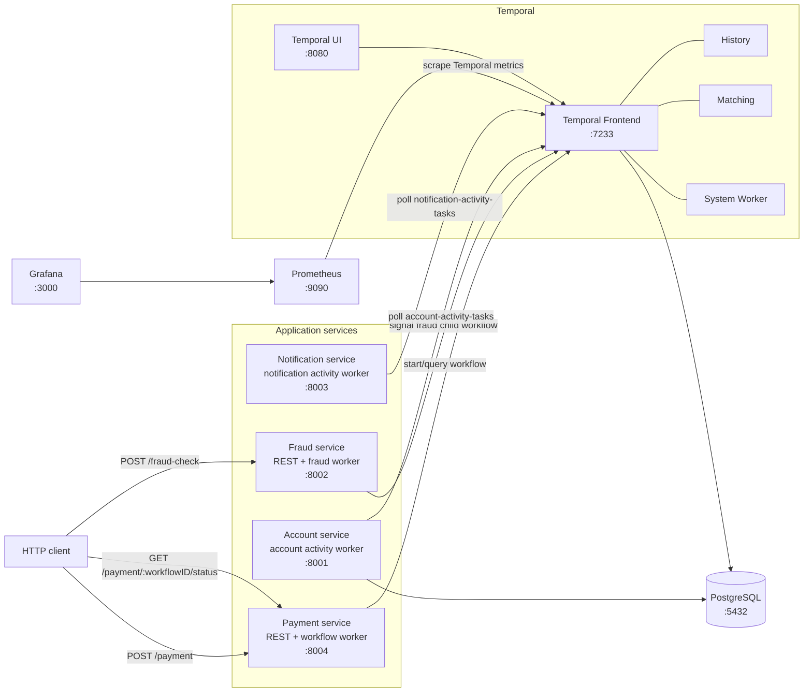
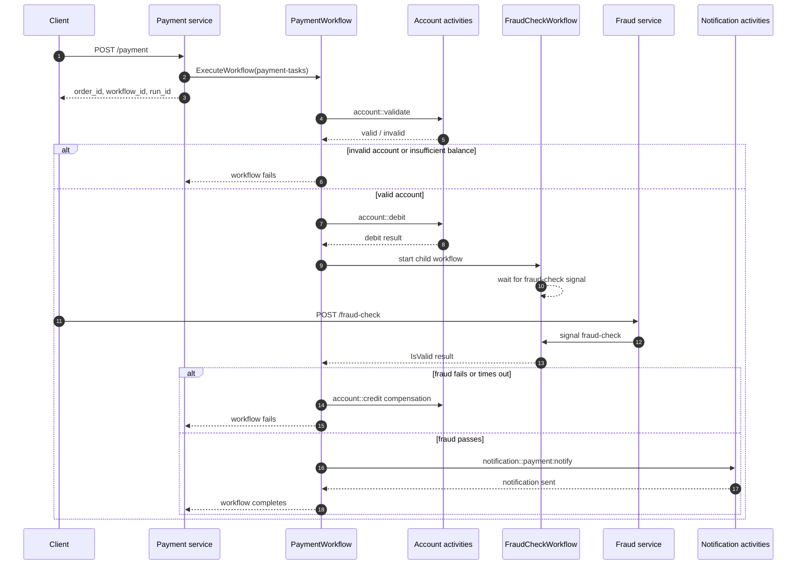
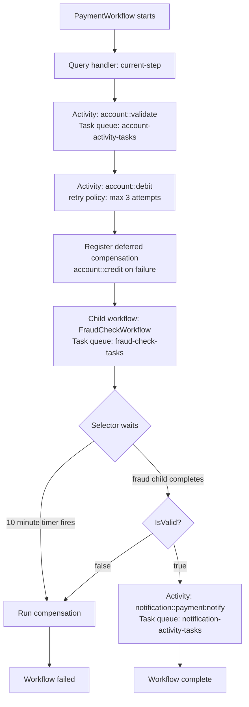

# Temporal Practice

Fintech-style Temporal practice project for learning workflow orchestration with Go microservices. The system models a payment flow where a payment request is started over HTTP, orchestrated by a Temporal workflow, validated against account data, checked by a child fraud workflow, compensated with Saga-style refund logic when needed, and finalized with a notification activity.

## What This Project Demonstrates

- Temporal workflows, activities, task queues, retries, timers, signals, queries, and child workflows.
- Saga compensation for refunding a debit when later workflow steps fail.
- Separate Go services for payment orchestration, account activities, fraud signaling, and notifications.
- Local Temporal Server, Temporal UI, PostgreSQL, Prometheus, and Grafana through Docker Compose.
- Go workspace layout with shared workflow and activity contracts.

## Architecture



## Payment Workflow



## Temporal Concepts In Use



## Repository Structure

| Path | Purpose |
| --- | --- |
| `account/` | Account activity worker. Owns account persistence, seeded account balances, validation, debit, and credit logic. |
| `payment/` | Payment REST API and `PaymentWorkflow` worker. Starts workflows and queries payment status. |
| `fraud/` | Fraud REST API and `FraudCheckWorkflow` worker. Sends fraud-check signals to child workflows. |
| `notification/` | Notification activity worker. Handles mock SMS/payment notification activity execution. |
| `shared/` | Shared Temporal contracts: workflow definitions, activity names, task queues, params, results, and workflow tests. |
| `reporting/` | Placeholder Go module for future reporting/query service work. |
| `temporal/` | Temporal dynamic config. |
| `temporal-admin-tools/` | Temporal SQL schema setup script used by Docker Compose. |
| `temporal-create-namespace/` | One-shot namespace creation script. |
| `prometheus/` | Prometheus scrape configuration. |
| `grafana/` | Grafana provisioning, dashboard, and datasource configuration. |
| `docker-compose.yml` | Local infrastructure and service orchestration. |
| `Dockerfile` | Shared multi-stage build for each Go service selected by `SERVICE`. |
| `PROJECT_REQUIREMENTS.md` | Original learning goals, business requirements, and feature checklist. |

## Components

### Payment Service

- Exposes `POST /payment`.
- Starts `PaymentWorkflow` on task queue `payment-tasks`.
- Exposes a status query endpoint intended as `GET /payment/:workflowID/status`.
- Registers the workflow query handler `current-step`.
- Runs Swagger UI at `/swagger`.

### Account Service

- Connects to PostgreSQL with GORM.
- Migrates and seeds accounts at startup:
  - `1`: balance `1000`
  - `2`: balance `1000`
  - `3`: balance `0`
  - `4`: balance `9223372036854775807`
- Registers activities on task queue `account-activity-tasks`:
  - `account::validate`
  - `account::debit`
  - `account::credit`

### Fraud Service

- Exposes `POST /fraud-check`.
- Registers `FraudCheckWorkflow` on task queue `fraud-check-tasks`.
- Signals child workflows named `fraud-check-{order_id}` with signal name `fraud-check`.
- Runs Swagger UI at `/swagger`.

### Notification Service

- Registers notification activities on task queue `notification-activity-tasks`.
- Handles `notification::payment:notify`.
- Currently mocks SMS delivery by printing notification details.

### Shared Module

The `shared/` module contains the Temporal workflow and activity API surface that all services import. This keeps workflow names, task queues, signal names, DTOs, and tests consistent across the workspace.

## Local Development

### Prerequisites

- Docker and Docker Compose
- Go `1.25.1`
- Make

### Start Everything

```bash
make up
```

Useful local URLs:

| Service | URL |
| --- | --- |
| Temporal Frontend | `localhost:7233` |
| Temporal UI | `http://localhost:8080` |
| Prometheus | `http://localhost:9090` |
| Grafana | `http://localhost:3000` |
| Account service | `http://localhost:8001` |
| Fraud service | `http://localhost:8002` |
| Notification service | `http://localhost:8003` |
| Payment service | `http://localhost:8004` |
| Payment Swagger | `http://localhost:8004/swagger` |
| Fraud Swagger | `http://localhost:8002/swagger` |

### Common Commands

```bash
make build
make rebuild payment
make logs -f payment
make ps
make down
make clean
make tctl workflow list
make mod-tidy
```

## Example Workflow Run

Start a payment:

```bash
curl -X POST http://localhost:8004/payment \
  -H 'Content-Type: application/json' \
  -d '{"account_id":"1","amount":100}'
```

Example response:

```json
{
  "order_id": "7a6a6a7d-2f25-4a6c-85ac-5c1b4f6c90ef",
  "workflow_id": "payment-3d95bb05-4b97-4a58-9f50-2f47bb27d9a3",
  "run_id": "..."
}
```

Approve or reject the fraud check by signaling the child workflow through the fraud service:

```bash
curl -X POST http://localhost:8002/fraud-check \
  -H 'Content-Type: application/json' \
  -d '{"order_id":"7a6a6a7d-2f25-4a6c-85ac-5c1b4f6c90ef","is_valid":true}'
```

Query current payment step:

```bash
curl http://localhost:8004/payment/payment-3d95bb05-4b97-4a58-9f50-2f47bb27d9a3/status
```

You can also inspect the workflow, child workflow, events, signals, retries, and timers in Temporal UI at `http://localhost:8080`.

## Testing

Run the shared workflow unit tests:

```bash
go test ./shared/...
```

Run all workspace modules:

```bash
go test ./account/... ./fraud/... ./notification/... ./payment/... ./shared/...
```

The workflow tests cover account validation failure, debit failure, fraud timeout, fraud rejection, notification failure, and fraud signal handling.

## Current Implementation Status

Implemented:

- Payment orchestration workflow.
- Account validation, debit, and credit activities.
- Retry policies for activity execution.
- Fraud check child workflow.
- Fraud result signal handling.
- Fraud timeout timer.
- Payment notification activity.
- Query handler for the current payment step.
- Dockerized Temporal, PostgreSQL, Prometheus, Grafana, and services.

Still planned or incomplete according to `PROJECT_REQUIREMENTS.md`:

- External payment gateway mock and callback signal.
- User cancellation signal.
- Workflow versioning API usage.
- Reporting service.
- K6 load and stress test scenarios.

## Notes

- The account service reseeds the account table each time it starts.
- Failed steps after a successful debit trigger `account::credit` compensation.
- `PaymentWorkflow` currently waits up to 10 minutes for the fraud child workflow, while the original requirement mentions 5 minutes for gateway callbacks. The gateway callback workflow is not implemented yet.
